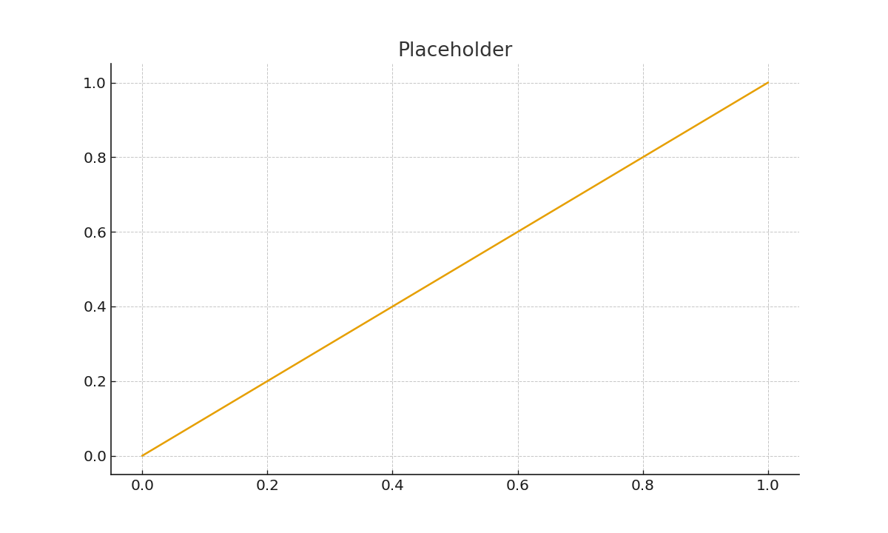

# [PROJECT_ID] — [PROJECT_TITLE]

## Title & Abstract
**Title:** [PROJECT_TITLE]  
**Abstract:** 2–3 sentence summary of purpose, domain, and expected outcomes.

## Mathematical Formulation
- **Equations:** (LaTeX-friendly Markdown)
  - Example: $\dot{x} = f(x, t; \theta)$
- **Variables & Parameters:** Define all symbols.
- **Assumptions/IC/BC:** State modeling assumptions, initial/boundary conditions.
- **Math Core:** (e.g., ODE, PDE, probability, optimization, graph theory)

## Algorithm Design (Pseudocode)
```
Inputs: [params], [IC], [T], [dt]
Process:
  1) define model f(x, t; theta)
  2) integrate/simulate
  3) collect metrics
Outputs: results (time series, fields, metrics)
```

## Implementation Notes
- See `model.py` (equations → code), `simulate.py` (runs experiments), `viz.py` (plots).
- Configuration in `config.yaml`. Ontology tags in `meta.json`.

## Visualizations
- Export figures to `figs/` and embed below.


## Reflection
- **Assumptions & limitations:** …  
- **Possible extensions:** …  
- **Domain relevance:** …

## Integration
- **Domain:** [physics|biology|chemistry|math|…]
- **Math Core:** [ODE|PDE|probability|optimization|graph]
- **Computational Tools:** [NumPy, SciPy, …]
- **Visualization Type:** [phase portrait, heatmap, …]
- **Related Projects:** [IDs]

---

### Reproducibility
```bash
python -m venv .venv && source .venv/bin/activate
pip install -r requirements.txt
python simulate.py --config config.yaml
python viz.py --input results.parquet --outdir figs/
```